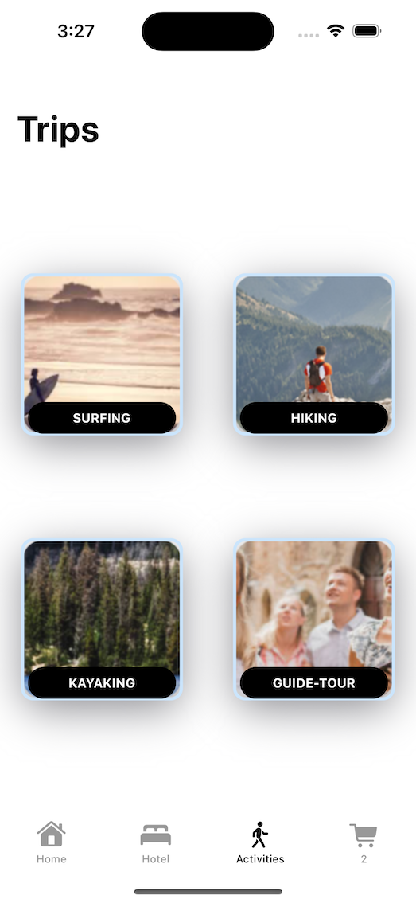
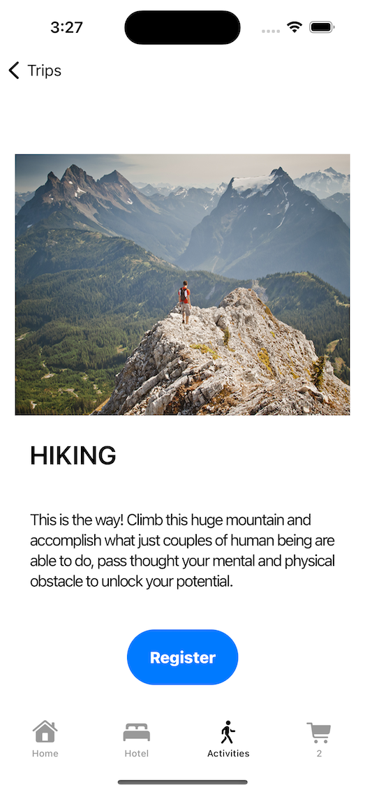
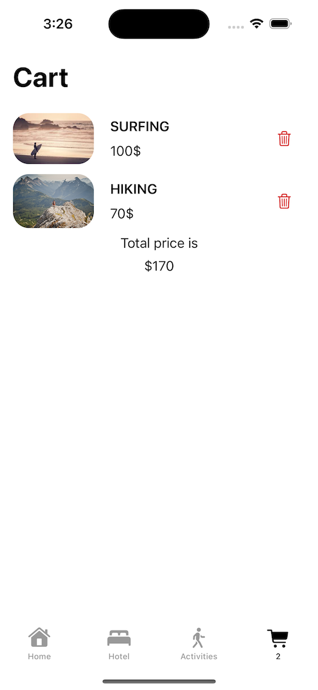

#  Booking Travel App

- E-commerce app to book an hotel and activities.

## Technologies Used
- Swift
- SwiftUI
- Xcode

## Concepts Learned

- How to modal the navigation using 2 screens by using $Binding and $State and Environnement Object
- How to layout the screen to display the contents in every screen, dark mode and portrait/landscape mode.
- How to fit an image in a circle within overlay 
- How to use MVVM design partern

