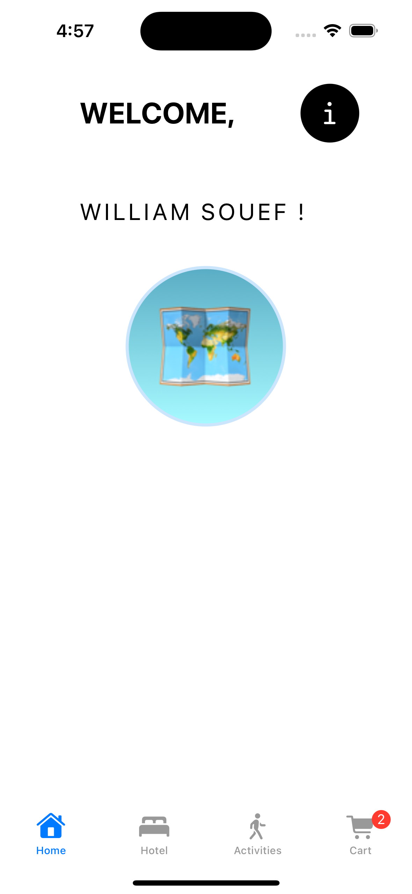
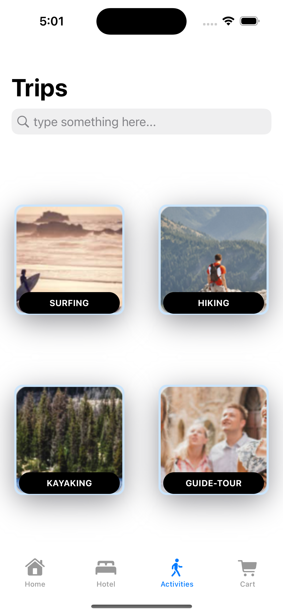
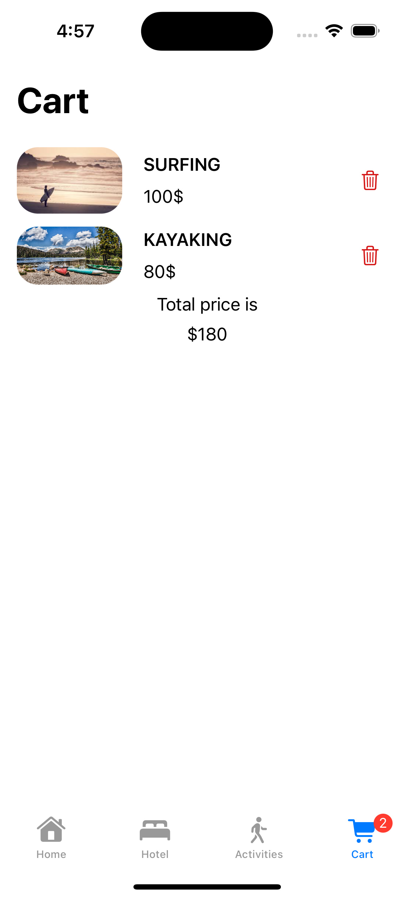

#  Booking Travel App

- E-commerce travel booking app to book hotels and activities.

## Technologies Used
- Swift
- SwiftUI
- Xcode

- How to modal the navigation using 2 screens by using $Binding and $State and Environnement Object.
- Creating the logic to add and delete trips in the Cart View
- Creating a custom  layout list.
- How to layout the screen to display the contents in every screen, dark mode and portrait/landscape mode.
- How to use MVVM design partern.

